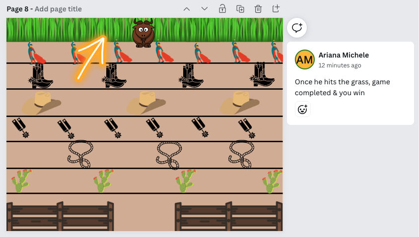
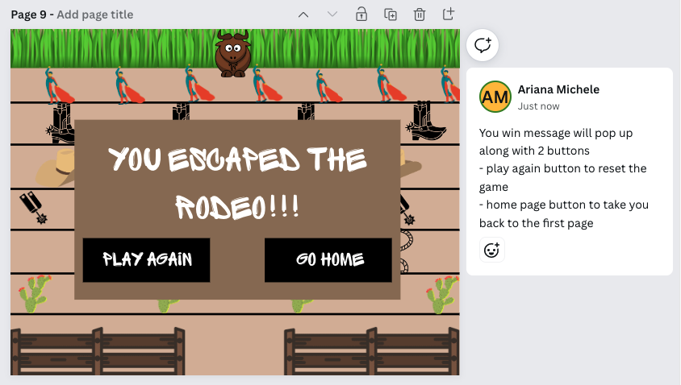

# EscapeTheRodeo
USER STORY:
1. User should open the game
2. User will be presented with the title and 2 buttons
    - One button will be for instructions
    - One button will be to start the game
3. User will click on instructions
    - Title page should disappear
    - Instructions page should appear
    - This should display the rules of the game
    - User should see a button on this page
    - The button should take the user back home
4. User will click the play button
    - Title frame will disappear
    - clear "gameboard" will appear
    - countdown (maybe loop) of images will appear to start
5. At start of game -- image Objects will appear
6. Different Rows will have different images
    - Each row should move at a different speed
    - Each row should alternate different directions
7. User will move Toro moving the arrow keys
    - User will be able to move up, down, left, and right
8. If contact is made to Toro from any object
    - trigger a "You Lose" screen
    - this screen should mimic the win screen, with an alternate message
    - this screen will overlap the game
    - movement of all rows should stop at this point
9. If contact is made to the pasture
    - this will trigger the win screen
    - this will overlap on the screen 
    - movement of all rows should stop at this point
10. On lose and win screens there will be two buttons
    - play again to restart the game
        - this will take you back to the start countdown
    - go home button
        - this will take you back to the title page

Wire Frames:

1. 
2. 
3. 
4. 
5. 
6. 
7. 
8. 
9. 

Stretch Goals:
Create a timer for how long it takes to get across
Time could give you a score and you could utilize local storage to keep a high score log
Have an item randomly pop into spots, and require Toro to grab them before getting to the grass
