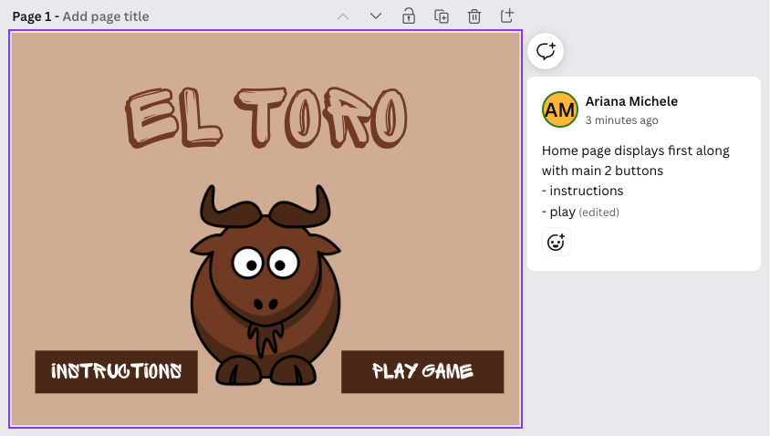
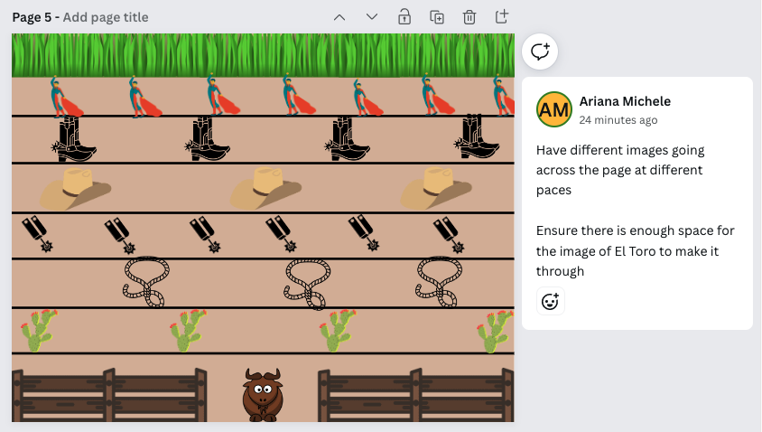

# EscapeTheRodeo
USER STORY:
1. User should open the game
2. User will be presented with the title and 2 buttons
    - One button will be for instructions
    - One button will be to start the game
3. User will click on instructions
    - Title page should disappear
    - Instructions page should appear
    - This should display the rules of the game
    - User should see a button on this page
    - The button should take the user back home
4. User will click the play button
    - Title frame will disappear
    - clear "gameboard" will appear
    - countdown (maybe loop) of images will appear to start
5. At start of game -- image Objects will appear
6. Different Rows will have different images
    - Each row should move at a different speed
    - Each row should alternate different directions
7. User will move Toro moving the arrow keys
    - User will be able to move up, down, left, and right
8. If contact is made to Toro from any object
    - trigger a "You Lose" screen
    - this screen should mimic the win screen, with an alternate message
    - this screen will overlap the game
    - movement of all rows should stop at this point
9. If contact is made to the pasture
    - this will trigger the win screen
    - this will overlap on the screen 
    - movement of all rows should stop at this point
10. On lose and win screens there will be two buttons
    - play again to restart the game
        - this will take you back to the start countdown
    - go home button
        - this will take you back to the title page

Wire Frames:

1. 
2. 
3. 
4. 
5. 
6. 
7. 
8. 
9. 

Stretch Goals:
Create a timer for how long it takes to get across
Time could give you a score and you could utilize local storage to keep a high score log
Have an item randomly pop into spots, and require Toro to grab them before getting to the grass

PROCESS:
I started this project with a lot of researching various games online to see how other worked and got started. Looking back, I think I spent too much time on that portion -- scared to get started without truly kowing what I was doing -- but should have learned through all the mistakes I would have made. I knew I wanted to utilize canvas. I staretd by creating multiple canvas layers to utlize throughout the process, even created too many. Once done I worked on creating Toro using a simple square. I utlized the arrow keys to then make him move. 

Once Toro was created, I began to make the rows of items. I ended up taking one away from my original idea. I played around with various number of objects and speeds while working through this process.  Once I had 5 rows created, going various directions and speeds, I began to work through finding the collision points. After was completed I worked through replacing the rectangles with images. This part gave me a ton of issues. I tried to place all images on one sprite sheet but kept ruining my code when messing around with it, and couldn't get all images to allign perfectly. 

I then chose to have each image on its own sheet due to them not needing to annimate for the game. Once the game was fully functioning I tried to create a "start page". I ultimtely could not figure out how to get the page to load before the rest of the game and was unable to add it. I hope to be able to go back and make the game more challenging for the user, as well as displaying better title and "gameover" displays. 